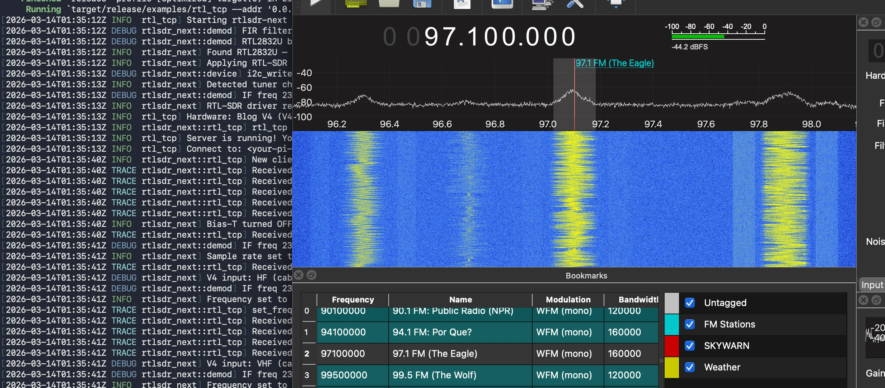

# rtlsdr-next 📡



[](https://github.com/mattdelashaw/rtlsdr-next/actions/workflows/rust.yml)

A high-performance, asynchronous, and safety-first Rust driver for RTL2832U-based Software Defined Radios (SDR).

Designed for the modern era (2026+), this driver moves away from the legacy C callback model toward a **Tokio-native Stream** architecture, with specific optimizations for high-bandwidth ARM hosts like the **Raspberry Pi 5**.

> [!CAUTION]
> This a shameless "vibe-code" project. I wanted to dig into Rust and this seemed like something fun to explore when I realized the gold version C code drivers were circa 2013. Since starting, I realized there is a human driven Rust implementation here: https://github.com/ccostes/rtl-sdr-rs

## ✅ Confirmed Working Hardware

| Dongle | Tuner | Host | Clients Tested |
|--------|-------|------|----------------|
| RTL-SDR Blog V4 | R828D | Raspberry Pi 5 (Bookworm) | OpenWebRX+, GQRX |

Other RTL2832U dongles with R820T/R820T2 tuners should work — hardware verification welcome.

## 🚀 Key Features

- **Async-First Architecture:** Built on Tokio. SDR data is a standard `Stream` with backpressure and graceful shutdown.
- **Full RTL-SDR Blog V4 Support:** Correct R828D initialization sequence reverse-engineered from usbmon traces against librtlsdr.
- **Zero-Allocation Pipeline:** Custom buffer pooling eliminates memory allocations in the hot path.
- **NEON SIMD Acceleration:** Optimized ARM NEON intrinsics for `u8` → `f32` conversion and FIR filtering on aarch64.
- **Automatic Tuner Probing:** I2C presence detection for Rafael Micro (R820T/R828D), Elonics (E4000), and Fitipower (FC0012/13).
- **Zero-Copy Broadcasting:** Share a single hardware device across multiple local apps via `Arc`-based broadcasting.
- **Precision Frequency Correction:** Integrated PPM correction for both tuner PLL and RTL2832U resampler.
- **rtl_tcp Server:** Drop-in compatible server for OpenWebRX+, GQRX, SDR#, and other rtl_tcp clients.

## 🛠 Hardware: The V4 Deep Dive

The RTL-SDR Blog V4 required several initialization steps discovered during reverse engineering via usbmon traces:

1. **GPIO Reset Pulse (non-V4 only):** Standard RTL-SDR dongles receive a GPIO 4 reset pulse during init. The V4 skips this entirely — librtlsdr detects the V4 by EEPROM string match and branches before the GPIO code. This driver mirrors that behavior exactly.

2. **R828D I2C Address:** The R828D responds at `0x74`, not `0x34` (which is the R820T address). Probing must try both.

3. **Low-IF Mode:** The R828D uses low-IF (not Zero-IF). After tuner detection, Zero-IF mode must be explicitly disabled (`page1 reg 0xb1 = 0x1a`) and the In-phase ADC input enabled (`page0 reg 0x08 = 0x4d`).

4. **I2C Chunk Size:** The RTL2832U I2C bridge has a maximum transfer size of 8 bytes (7 data + 1 register byte). The 27-byte tuner init array must be written in chunks or the USB endpoint stalls with a pipe error.

5. **Demod Register Sync:** Every demodulator register write must be followed by a dummy read of `page0 reg 0x01` — this is a hardware flush/sync requirement. Omitting it causes subsequent control transfers to stall.

6. **EEPROM Recovery:** If the dongle's EEPROM is corrupted (reverts to generic strings), restore it with the RTL-SDR Blog fork of rtl_eeprom:
   ```bash
   ~/rtl-sdr-blog/build/src/rtl_eeprom -m "RTLSDRBlog" -p "Blog V4" -s "00000001"
   ```

## 🚀 Performance

Benchmarked on Raspberry Pi 5 (Cortex-A76, aarch64):

| Operation | Throughput |
|-----------|------------|
| `u8` → `f32` converter | ~1.49 GiB/s |
| 33-tap FIR decimator (NEON) | ~670 MSa/s |
| CPU usage at 2.048 MSPS | < 6% |

## 📋 Prerequisites

- Rust toolchain (stable)
- libusb development headers
- USB access (see permissions setup below)

```bash
# Ubuntu/Debian
sudo apt-get install libusb-1.0-0-dev

# macOS
brew install libusb
```

## 🔌 USB Permissions

The recommended approach is a persistent udev rule rather than `chmod`:

```bash
# Create udev rule
echo 'SUBSYSTEM=="usb", ATTRS{idVendor}=="0bda", ATTRS{idProduct}=="2838", MODE="0666", GROUP="plugdev"' \
  | sudo tee /etc/udev/rules.d/99-rtlsdr.rules

# Reload and trigger
sudo udevadm control --reload-rules
sudo udevadm trigger

# Add yourself to plugdev if needed
sudo usermod -aG plugdev $USER
```

For quick testing only: `sudo chmod 666 /dev/bus/usb/$(lsusb | grep RTL | awk '{print $2"/"$4}' | tr -d ':')`

## 🏗 Building

```bash
git clone https://github.com/mattdelashaw/rtlsdr-next
cd rtlsdr-next
cargo build --release
```

For maximum Pi 5 performance, set the target CPU explicitly:

```bash
RUSTFLAGS="-C target-cpu=native" cargo build --release
```

## ▶️ Examples

### Main Examples

| Example | Description |
|---------|-------------|
| `hw_probe` | **Start here.** Full driver smoke test — init, tune, stream 1s, report throughput. Clear PASS/FAIL output. |
| `rtl_tcp` | rtl_tcp-compatible server. Connect GQRX, SDR#, or OpenWebRX+ as a network source. |
| `fm_radio` | FM receiver with built-in demodulator. Outputs audio via the system audio device. |
| `websdr` | WebSocket SDR server with waterfall and audio. Browse to `http://localhost:8080`. |
| `monitor` | Continuous stream monitor — logs average signal magnitude and throughput every 10 blocks. |

```bash
# Smoke test — run this first
RUST_LOG=info cargo run --release --example hw_probe

# rtl_tcp server — connect any SDR client
RUST_LOG=info cargo run --release --example rtl_tcp -- --addr 0.0.0.0:1234

# FM radio
RUST_LOG=info cargo run --release --example fm_radio -- --freq 97.1e6

# WebSDR
RUST_LOG=info cargo run --release --example websdr
```

### Diagnostic Examples

These are raw USB tools used during driver development. They bypass the driver
entirely and speak directly to the hardware via libusb. Run them when you need
to determine whether a problem is in the driver or the hardware.

| Example | Description |
|---------|-------------|
| `diag_write` | Scans all 8 USB control blocks for register responses. Use when debugging Pipe errors. |
| `diag_i2c` | Probes demod read/write encoding patterns and validates the dummy-read flush requirement. |
| `diag_demod` | Re-acquisition probe — tries up to 5 times to reclaim a busy/crashed USB interface. |
| `diag_sys` | Dumps registers from USB/SYS/DEMOD blocks using both encoding patterns. |
| `diag_raw_clone` | Replays the exact V4 init sequence raw. The definitive "hardware vs driver" test. |

```bash
# Is it the hardware or the driver?
RUST_LOG=debug cargo run --release --example diag_raw_clone

# Device stuck as busy after a crash?
cargo run --release --example diag_demod

# Pipe errors on demod writes?
cargo run --release --example diag_i2c
```

## 🧪 Testing

```bash
# Unit tests (no hardware required)
cargo test

# Release mode (also runs NEON/scalar agreement tests on aarch64)
cargo test --release
```

Hardware-in-the-loop tests require a connected dongle and are run manually via the examples.

## ⚙️ Environment Variables

| Variable | Default | Description |
|----------|---------|-------------|
| `RUST_LOG` | `warn` | Log level: `error`, `warn`, `info`, `debug`, `trace` |
| `RTLSDR_DEVICE_INDEX` | `0` | USB device index if multiple dongles are connected |

-### Baseline Comparisons
-Measurements taken on an ARM64 host comparing the `rtlsdr-next` Rust implementation against the `librtlsdr` (v4 branch) C baseline using 256KB blocks:

| Benchmark Task | librtlsdr (C) | rtlsdr-next (Rust) |
| :--- | :--- | :--- |
| **Standard Converter** (256KB) | **172.32 µs** | **164.35 µs** |
| *Throughput* | 1.4168 GiB/s | 1.4855 GiB/s |
| *Range [min ... max]* | [172.29 µs ... 172.36 µs] | [164.13 µs ... 164.78 µs] |
| | | |
| **V4 Inverted Converter** | **256.07 µs** | **170.81 µs** |
| *Throughput* | 976.30 MiB/s | 1.4293 GiB/s |
| *Range [min ... max]* | [256.02 µs ... 256.14 µs] | [170.78 µs ... 170.84 µs] |
| | | |
| **Decimation (FIR/4)** | **N/A** | **778.40 µs** |
| *Throughput* | N/A | 336.77 Melem/s |
| | | |
| **Decimation (FIR/8)** | **N/A** | **615.37 µs** |
| *Throughput* | N/A | 425.99 Melem/s |
| | | |
| **Decimation (FIR/16)** | **N/A** | **534.04 µs** |
| *Throughput* | N/A | 490.87 Melem/s |
| | | |
| **Full Pipeline (FIR/4)** | **N/A** | **925.26 µs** |
| *Throughput* | N/A | 270.19 MiB/s |
| | | |
| **Full Pipeline (FIR/8)** | **N/A** | **761.17 µs** |
| *Throughput* | N/A | 328.44 MiB/s |
| | | |
| **Full Pipeline (FIR/16)** | **N/A** | **678.84 µs** |
| *Throughput* | N/A | 368.27 MiB/s |


-*Note: The performance gain in conversion is primarily due to moving from cache-latency-bound lookup tables to instruction-parallel arithmetic, which better utilizes modern out-of-order CPU pipelines.*

## 🗺 Roadmap - Phaseshifting

- [x] **Phase 1: Hardware Bridge** — USB vendor requests, I2C bridge, control transfer encoding
- [x] **Phase 2: R828D / V4 Support** — Full tuner initialization, PLL, gain tables
- [x] **Phase 3: Async Stream** — Tokio-native stream with backpressure and graceful shutdown
- [x] **Phase 4: DSP Pipeline** — NEON SIMD FIR decimation, FM demodulator, AGC, DC removal
- [x] **Phase 5: Device Sharing** — Zero-copy Arc broadcasting, Unix socket server
- [x] **Phase 6: Auto Probing** — I2C handshake-based tuner detection
- [x] **Phase 7: Zero-Allocation** — Buffer pooling, in-place processing
- [x] **Phase 8: rtl_tcp Server** — Compatible with OpenWebRX+, GQRX, SDR#
- [ ] **Phase 9: Legacy Tuners** — E4000, FC0012/FC0013 register maps
- [ ] **Phase 10: Cross-Platform** — Windows/macOS testing, x86_64 SIMD (AVX2)
- [ ] **Phase 11: Configurables** — Runtime buffer sizes, gain modes, bias-T persistence

## 📝 Reference Material

### Tuner Datasheets and Drivers

**Another Rust Implementation**
- [RTL-SDR-RS](https://github.com/ccostes/rtl-sdr-rs) - probably human driven project

**Rafael Micro R820T / R820T2 / R828D**
- [R820T Datasheet (leaked draft)](https://github.com/josebury/R820T-Datasheet/blob/master/R820T_Datasheet-Non_Disclosure_Working_Draft.pdf) — gold standard for register maps
- [RTL-SDR Blog V4 Guide](https://www.rtl-sdr.com/V4/) — V4-specific hardware details
- [tuner_r82xx.c](https://github.com/rtlsdrblog/rtl-sdr-blog/blob/master/src/tuner_r82xx.c) — reference C implementation

**Elonics E4000** (legacy, up to 2.2 GHz, gap ~1.1 GHz)
- [Osmocom E4000 Wiki](https://osmocom.org/projects/rtl-sdr/wiki/E4000)
- [tuner_e4k.c](https://github.com/osmocom/rtl-sdr/blob/master/src/tuner_e4k.c)

**Fitipower FC0012 / FC0013** (budget nano dongles)
- [tuner_fc0012.c](https://github.com/osmocom/rtl-sdr/blob/master/src/tuner_fc0012.c)

### RTL2832U

- [Osmocom RTL-SDR Wiki](https://osmocom.org/projects/rtl-sdr/wiki/Rtl-sdr) — the definitive reference
- [librtlsdr.c](https://github.com/rtlsdrblog/rtl-sdr-blog/blob/master/src/librtlsdr.c) — comments are essentially the RTL2832U register manual

## 📜 License

Licensed under the Apache License, Version 2.0.
